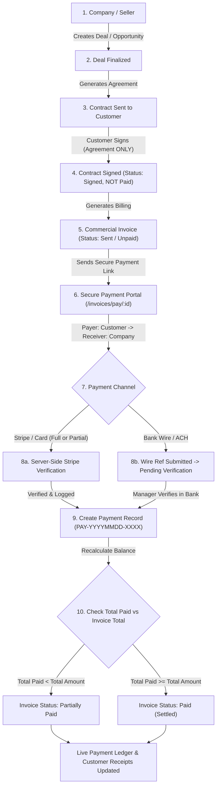

# Redesign Payment Workflow: Real-World CRM Payment Architecture

## Overview
This plan establishes a complete, real-world enterprise CRM payment workflow that rigorously separates **Contract Acceptance/Signature** (legal agreement to terms) from **Payment Processing** (financial fund transfer from Customer/Buyer to Company/Seller), introduces explicit **Payer (Customer) vs. Receiver (Company)** tracking across all layers, and provides full support for **partial, milestone, and multiple payments per invoice**.

---

## User Review Required

> [!IMPORTANT]
> **1. Contract vs Payment Separation**:
> Signing a contract will **never** automatically mark an invoice or contract as paid. It marks the contract as `Signed` and transitions/links an official `Invoice` in `Sent` (unpaid) status, enabling the customer to subsequently make single or partial payments via the payment portal.
>
> **2. Payer vs Receiver Transparency**:
> The public payment portal (`/invoices/pay/:id`), invoice view, and receipt documents will prominently display **"RECEIVER / SELLER"** (Company Name, Address, Tax ID, Bank Details) vs. **"PAYER / BUYER"** (Customer Name, Email, Organization, Billing Info).
>
> **3. Partial & Multi-Payment Support**:
> Customers can choose to pay the **Full Remaining Balance** or enter a **Custom Partial Amount** (e.g. 30% upfront deposit or milestone payment). Each transaction creates its own immutable `Payment` record, and the invoice dynamically calculates `AmountPaid`, `BalanceDue`, and updates status to `PartiallyPaid` or `Paid`.

---

## Proposed Architecture & Changes

### 1. Domain Entities & Database Schema

#### `CrmSystem.Domain/Entities/Payment.cs` & `Invoice.cs`
- In `Payment.cs`:
  - `PayerCustomerId` (`CustomerId` foreign key to `Customer`)
  - `ReceiverCompanyId` (foreign key or company identifier for the seller)
  - `Provider` (`Stripe`, `BankWire`, `ManualCash`, `ManualCheck`, `POS`)
  - `PaymentMethod` (`CreditCard`, `DebitCard`, `BankWire`, `ACH`, `Cash`, `Check`)
  - `Amount` (The specific amount paid in this transaction)
  - `Currency` (`USD`)
  - `Status` (`Completed`, `PendingVerification`, `PartiallyPaid`, `Failed`, `Refunded`, `Cancelled`)
  - `TransactionReference` (Stripe PaymentIntent/Session ID, or Bank Wire Ref #)
  - `PaymentDate`, `ReceiptUrl`, `Notes`
- In `Invoice.cs`:
  - Calculated / tracked properties:
    - `TotalAmount`
    - `AmountPaid` (Sum of all completed `Payment.Amount` records)
    - `BalanceDue` (`TotalAmount - AmountPaid`)
    - `Status`: `Draft`, `Sent`, `PendingVerification`, `PartiallyPaid`, `Paid`, `Overdue`, `Cancelled`

---

### 2. Backend API Controllers & Business Logic

#### `CrmSystem.Api/Controllers/PublicInvoicesController.cs`
- `GET /api/public/invoices/{id}`:
  - Returns complete invoice details with explicit `seller` (Company details) and `buyer` (Customer details), `totalAmount`, `amountPaid`, `balanceDue`, `status`, and full list of historical payments.
- `POST /api/public/invoices/{id}/pay`:
  - Accepts `amount` (supports paying full balance or custom partial amount), `cardHolderName`, `cardNumberLast4`, `paymentMethod`.
  - Server-side validates that `amount > 0` and `amount <= balanceDue`.
  - Creates a `Payment` record with `Status = "Completed"`.
  - Recalculates total paid: If `AmountPaid >= TotalAmount`, sets invoice to `Paid`. If `AmountPaid < TotalAmount`, sets invoice to `PartiallyPaid`.
  - Dispatches SignalR real-time event to sales rep & finance team.
- `POST /api/public/invoices/{id}/pay-wire`:
  - Accepts `amount` (partial or full), `wireReference`, `senderBankName`, `notes`.
  - Creates a `Payment` record with `Status = "PendingVerification"`.
  - Sets invoice status to `PendingVerification` (or updates notes if partially paid).
- `POST /api/public/invoices/{id}/stripe-checkout`:
  - Accepts optional partial `amount` to charge; creates Stripe Checkout session with exact amount.
- `GET /api/public/invoices/{id}/verify-stripe-session`:
  - Verifies session with Stripe, records `Payment` entity, and settles/partially settles invoice.
- `POST /api/webhooks/stripe`:
  - Verifies webhook signature, extracts payment intent amount, and creates `Payment` entity.

#### `CrmSystem.Api/Controllers/PaymentsController.cs`
- `GET /api/payments`:
  - Returns all payments with Payer, Receiver, Invoice, Amount, Method, Date, and Status.
- `GET /api/payments/metrics`:
  - Real-time revenue metrics: Total Collected, Outstanding Receivables (Balance Due across open invoices), Pending Wires, Total Completed Transactions.
- `POST /api/payments/{id}/verify-wire`:
  - Staff verifies bank wire arrival in company account. Marks `Payment` as `Completed` and recalculates Invoice `AmountPaid` and `BalanceDue` (`Paid` or `PartiallyPaid`).
- `POST /api/payments/manual`:
  - Allows staff to record partial or full offline cash/check payments against unpaid balances.

---

### 3. Frontend Client Screens

#### `CrmSystem.Client/src/screens/PublicInvoicePayScreen.tsx`
- **Payer vs Receiver Header**:
  - **Receiver / Payee**: "Enterprise CRM Solutions Inc. (Seller)"
  - **Payer / Buyer**: Customer Name, Email, Phone, Company.
- **Payment Balance & Multi-Payment Summary**:
  - Total Invoice: `$10,000.00`
  - Total Paid to Date: `$3,000.00` (with list of past receipts)
  - **Remaining Balance Due: `$7,000.00`**
- **Flexible Payment Amount Selector**:
  - [x] Pay Full Remaining Balance (`$7,000.00`)
  - [ ] Pay Custom Partial Amount (e.g. Deposit / Milestone: `$3,500.00`)
- **Payment Tabs**:
  - Tab 1: **Credit / Debit Card & Stripe** (Instant online settlement).
  - Tab 2: **Direct Bank Wire / ACH** (Company bank info + wire ref submission).
- **Live Receipts Ledger**:
  - Shows breakdown of previous payment installments with printable tax receipts.

#### `CrmSystem.Client/src/screens/PaymentsScreen.tsx`
- Displays full multi-payment ledger with Payer, Receiver, Invoice Ref, Amount, Invoice Status (`Partially Paid`, `Paid`, `Pending Verification`).
- Action to verify pending wires, issue partial refunds, and record offline cash/check installments.

#### `CrmSystem.Client/src/screens/InvoicesScreen.tsx`
- Displays payment progress bar on each invoice (e.g. `$3,000 / $10,000 (30% Paid - Partially Paid)`).

#### `CrmSystem.Client/src/screens/PublicContractSignScreen.tsx`
- When contract is signed: Confirms "Contract Agreement Signed!". Displays link to "Proceed to Invoice & Payment Portal" without confusing signing with payment.

---

## Verification Plan

### Automated Tests
- Run `dotnet test` ensuring all 45+ existing tests and new payment/invoice status calculations pass.
- Run `npm run build` validating all TypeScript interfaces and screens.

### Manual End-to-End Workflow Verification
1. **Deal & Contract**: Create Deal &rarr; Generate Contract &rarr; Sign Contract as Customer &rarr; Verify Contract status is `Signed` and Invoice status is `Sent` (Unpaid $10,000).
2. **Partial Payment 1**: Open invoice payment link &rarr; Select "Pay Partial Amount: $3,000" via Card &rarr; Verify Payment #1 is created ($3,000), Invoice status updates to `PartiallyPaid`, Remaining Balance is `$7,000`.
3. **Partial Payment 2**: Customer opens link again &rarr; Selects "Pay Remaining Balance: $7,000" &rarr; Completes payment &rarr; Verify Payment #2 is created ($7,000), Invoice status updates to `Paid`, Remaining Balance is `$0`.
4. **CRM Payments Dashboard**: Verify both Payment #1 and Payment #2 appear in `/payments` with Payer (Customer) & Receiver (Company) details.
